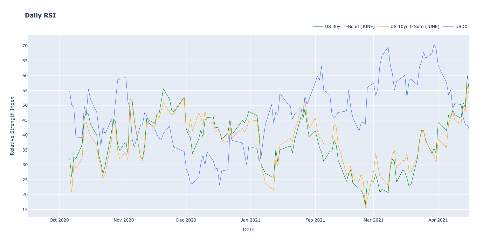
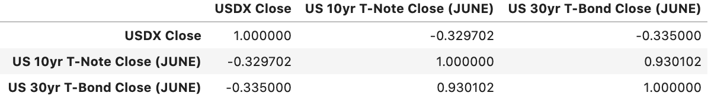
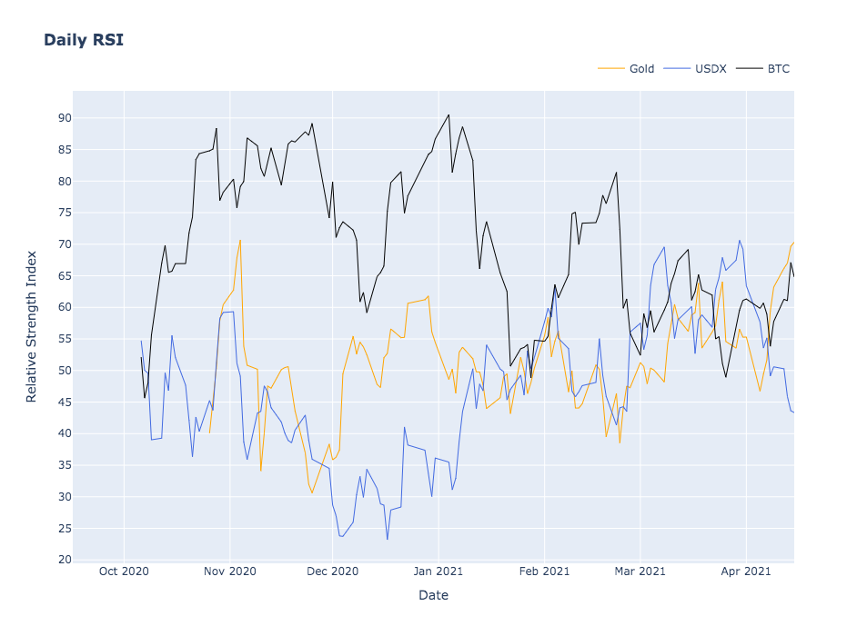

# University of Miami FinTech Bootcamp Project 1

## **Correlational Research Study Between the Treasury Markets, The US Dollar Index, Gold, and Bitcoin**

_This Project aims to measure and assess the correlational relationship between four different assets: the 30 Year US T-Bond, the 10 Year US T-Note, the US Dollar Index, Gold, and Bitcoin. Our method was done through historical data analysis of the closing prices of each asset. We take a further step and utilize the RSI Divergence in the analysis of the Treasury Markets and the US Dollar to identify a change in price momentum before a change in price action can be observed._

---

## Table of Contents

- [Technologies We Installed](#technologies-we-installed)
- [Data Sources Used](#data-sources-used)
- [What is the RSI?](#what-is-the-rsi)
- [Bonds vs. US Dollar Index Concept](#bonds-vs-us-dollar-index-concept)
- [Gold and Bitcoin as Safe Haven Assets](#gold-and-bitcoin-as-safe-haven-assets)
- [Research Questions We look to Answer](#research-questions-we-look-to-answer)
- [Analysis](#analysis)

---

## Technologies We Installed

In the course of this project we used several technologies:

- Git and Github for Version Control
- Python
- Pandas
- Numpy
- Matplotlib
- yfinance Library
- pycoingecko
- Quandl

## Data Sources Used

### Treasury Markets and the US Dollar Index

In order to perform the data analysis for the 30 Year US Treasury Bond, 10 Year US Treasury Note, and the US Dollar Index, we pulled the data from Yahoo Finance. However, since the Yahoo Finance API was decommissioned in 2017, we installed and imported yfinance.

**yfinance** is a popular open source library built to gain access to financial data from Yahoo Finance. yfinance was built when the Yahoo Finance API was decommissioned.

We accessed data for approximately one year because we analyzed the June Futures Contract of the 30 Year US Treasury Bond (ticker symbol on Yahoo Finance is 'ZBM21.CBT') and the 10 Year US Treasury Note (ticker symbol on Yahoo Finance is 'ZNM21.CBT'). So all three assets where analyzed for the same time period.

### Gold and Bitcoin

In order to run analysis on bitcoin and gold we used two data sources. To access the historical data for gold we used investing.com which allowed us to pull the historical closing prices for gold in .csv format. To access Bitcoin’s historical data we were able to obtain the closing price data through Coin Gecko’s API.

**Coin Gecko** is a platform used to conduct research on crypto currencies, we were able to access this information by installing the pycoingecko library.

When we compared these two assets to the Treasury Markets and gathered information for approximately the last year to coincide with data we pulled for the USDX and Treasury Bonds.

## What is the RSI?

### The Relative Strength Index or RSI

A quick summary of the RSI:

- created in in 1978 as a momentum indicator with an optimal look-back period of 14 bars, by J. Welles Wilder.
- the goal is to find areas or zones where the asset is overbought or oversold.
- this method was created to give fundamental analysts a quick way to assess overvalued or undervalued assets.

### RSI Divergence

One way to look at RSI divergence is the RSI can show a change in price momentum, before you see a change in price action. You can think of it as an early warning signal.

> **RSI Divergenc**e occurs when the Relative Strength Index indicator starts reversing before price does. A **bearish divergenc**e consists of an overbought RSI reading, followed by lower high on RSI. At the same time, price must make a higher high on the second peak, where the RSI is lower. In a **bullish divergence** situation, there must be an oversold condition on the RSI, followed by a higher low on the RSI graph. Simultaneously, price must form a lower low on the second peak.

### Application of the RSI for our Project

J. Welles Wilder's original RSI used a smoothed moving average, we instead used the exponential weighted moving average, since it is what is used in most trading packages.

So we:

- took the spread of each time period; essentially the close of the current candle to the close of the previous candle.
- segregated each up and down period to a positive or negative difference, with all things equal to zero.
- calculated an exponential weighted moving average with a period of 14 days of the up and down periods.
- calculated the relative strength (RS) by the ratio of up and down averages.
- used the RSI formula to normalize the values between 0-100.

## Bonds vs. US Dollar Index Concept

From anecdotal evidence, a pattern was noted in the movement of the Treasury Markets and the US Dollar Index. As money was flowing into the bonds market, the US Dollar Index was experiencing bearish trends. The same was seen vice versa. This led to an understanding that investors move money when they view the US Dollar as weak into the bonds market.

Our hypothesis held _there is a direct inverse relationship between the Bonds market and the US Dollar Index_. Essentially, when the 30 Year T-bond and the 10 Year T-Note would rally, we should see the US Dollar Index move bearish. Similarly, when the US Dollar rallies, we should see the 30 Year T-Bond and 10 Year T-Note move bearish. The opposite scenario would be seen, as well.

## Gold and Bitcoin as Safe Haven Assets

After comparing the RSI of the 10 year, 30 year and usdx we wanted to see if there were any relationships with other assets and the usdx. We chose to use both Gold and a Bitcoin as both has been hailed as hedges against the dollar. Our hypothesis held _there is a positively correlated relationship between Gold and Bitcoin._

## Research Questions We look to Answer

- What relationships are seen between the three assets (30 year T-Bond, 10 year T-Note, and the US Dollar Index (USDX)?
- How can we apply our findings to currency pair movements?
- Is there a correlation between Gold and Bitcoin?
- Can the RSI Divergence identitfy a change in price momentum?
- Is there a correlation between Gold, Bitcoin, and the US Dollar Index?

## Analysis

As aforementioned, the data used for the Treasury Markets were based on the June Futures Contracts so the time period was only for one year when analyzed against the US Dollar Index. In the analysis, we were able to note a direct inverse relationship between the 30 Year T-bond + 10 Year T-Note, and the US Dollar Index, proving our hypothesis right.

There was a moderate correlation observed between the 30 Year T-bond + 10 Year T-Note, and the US Dollar Index. The highest-moderate inverse correlation was observed by the USDX and the 30 Year T-Bond at -0.335.

During the analysis of Gold and Bitcoin, we discovered our hypothesis regarding Gold and Bitcoin being positively correlated was proven incorrect.

From our findings we discovered that the RSI between Bitcoin and the USDX had a strong inverse correlation with a correlation coefficient of -0.539. Much to our surprise gold had a slightly positive correlation to with the USDX with a correlation coefficient of 0.289.

These indicators suggest that when USDX is in a bear market Bitcoin tends to be bullish territories. Gold however does not have much of a relationship with either asset with a small positive correlation with the USDX and a slight negative correlation with Bitcoin.

## References

- Fernando, J. (2021, April 07). Relative strength index (rsi). Retrieved April 24, 2021, from https://www.investopedia.com/terms/r/rsi.asp
- Kaabar, S. (2021, March 02). Back-testing the rsi divergence strategy on fx in python. Retrieved April 24, 2021, from https://kaabar-sofien.medium.com/back-testing-the-rsi-divergence-strategy-on-fx-in-python-c3680e7e2960
- RSI divergence explained " trading heroes. (2021, April 09). Retrieved April 24, 2021, from https://www.tradingheroes.com/rsi-divergence-explained/#:~:text=RSI%20Divergence%20occurs%20when%20the,where%20the%20RSI%20is%20lower
- Bade, M. (2020, November 16). Overlaying the relative strength index (rsi) on multiple stocks/crypto in python. Retrieved April 24, 2021, from https://medium.com/dev-genius/overlaying-the-relative-strength-index-rsi-on-multiple-stocks-crypto-in-python-64a46f9837a1
- Asset class correlation map. (n.d.). Retrieved April 24, 2021, from https://www.guggenheiminvestments.com/mutual-funds/resources/interactive-tools/asset-class-correlation-map
- BabyPips.com. (2021, April 15). How bond yields affect currency movements. Retrieved April 24, 2021, from https://www.babypips.com/learn/forex/the-411-on-bonds
- Gold futures historical prices. (n.d.). Retrieved April 24, 2021, from https://www.investing.com/commodities/gold-historical-data

## Contributors

- Jonathan Eidam
- William Tate Jones
- Sheldon Palm

## License

    Copyright 2021 Jonathan Eidam, William Tate Jones, and Sheldon Palm.
    This Project is subject to the GNU GPLv3 license.
